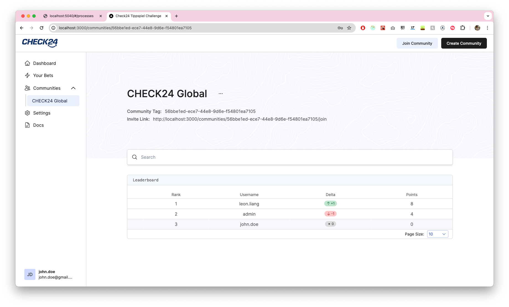

# [Check24 Tippspiel Challenge](https://github.com/check24-scholarships/check24-betting-challenge)

This coding challenge is about a betting game for the soon-to-be happening European Championship 2024, which takes place in Germany beginning at the 14th of June 2024. The goal is to create a simple application that allows you and your friends to bet on the outcome of the games and to display the current standings of the participants.

## Demo
\
Link: [https://www.youtube.com/watch?v=qluAdJPu7o0&ab_channel=LeonLiang](https://www.youtube.com/watch?v=qluAdJPu7o0&ab_channel=LeonLiang)

## Respository Structure
This repository is a _mono repository_ combining both client- and serverside services.
- [client](client) holds the [Next.js](https://nextjs.org/) frontend for end users and administrators.
- [server](server) holds the [Go Echo](https://echo.labstack.com/) backend.
- [docker](docker) holds the Dockerfiles for all third party services:
  - [Keycloak](https://www.keycloak.org/) as an open source identity and access management solution.
  - [Postgresql](https://www.postgresql.org/) as an open source object-relational database solution.
  - [Kafka](https://kafka.apache.org/) as an open-source distributed event streaming platform.
  - [Redis](https://redis.io/) for managing task queues.

## Getting started
### Run the local development environment
1. Install & run [Docker Desktop](https://www.docker.com/)
1. Install [Task](https://taskfile.dev/installation/)
1. Copy `client/.env.local.example` to `client/.env.local`
1. Copy `server/.env.example` to `server/.env`
1. Run `task up`
1. The frontend is available at [http://localhost:3000](http://localhost:3000). 
   The backend is available at [http://localhost:8000](http://localhost:8000).
   The backend documentation is available at [http://localhost:8000/swagger/index.html](http://localhost:8000/swagger/index.html)

Use the following credentials to authenticate Swagger UI:

| OAuth2Implicit |           |
|----------------|-----------|
| client_id      | webclient |

Log in to the admin account using the details below:

| Username | Password |
|----------|----------|
| admin    | 123      |

## Approach

### Real-time updates
In order to implement real-time updates, I have decided to opt for a hybrid between websockets and polling. 
The websocket connection merely notifies the client that the scores have been updated, upon which the client's cache is invalidated.
This prompts the client to re fetch the leaderboard standings from the server. 

Additionally, to deal with the [limitations of websockets](https://ably.com/topic/websockets-pros-cons#what-are-the-disadvantages-and-limitations-of-web-sockets), queries are refetched every 4 min as a contingency to ensure that the data is up to date.   

### Scalability
The following steps have been taken to ensure the scalability of the system to millions of users: 
- In order to prevent polling the database for changes, and causing unnecessary load as we scale up the number of our server instances, I have decided to use Apache Kafka as a distributed queue to propagate changes to the scores across all server instances. 
These server instances would notify the client over a websocket that the scores have been updated, prompting them to re fetch the updated leaderboard, as shown in the diagram below:

    

- Furthermore, I have bypassed the ORM for queries that could potentially yield a large number of results, opting instead to write raw SQL to take advantage of database-level optimizations.
- I also make use of workers to process potentially time intensive jobs, which are backed by Redis. For example, to recalculate the scores of all users in the background, the workers divide the total amount of users between themselves and, once completed, notify all server instances over Kafka, prompting the clients to re fetch the leaderboard.
- The leaderboard only fetches the users that are being displayed. When paginating, the additional users are fetched from the server and dynamically rendered into the current leaderboard. 

## Bonus
 

## Future Improvements
- Due to time constraints, I was unable to write unit tests for server-side services.

